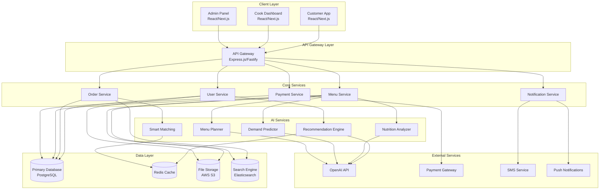

# Design Document: AI-Powered Home Food Network

## Overview

The AI-Powered Home Food Network is a sophisticated two-sided marketplace platform that connects working professionals with local home cooks through intelligent matching, personalized recommendations, and predictive analytics. The platform leverages modern web technologies, cloud infrastructure, and advanced AI capabilities to create a seamless experience for customers seeking healthy meals and cooks building home-based businesses.

The system architecture follows a microservices pattern with three primary user interfaces (Customer App, Cook Dashboard, Admin Panel) supported by a robust backend of AI-powered services including recommendation engines, nutrition analysis, demand forecasting, and smart matching algorithms.

## Architecture

### High-Level Architecture



### Technology Stack

**Frontend Applications:**

- **Framework:** Next.js 14 with React 18
- **Styling:** Tailwind CSS with Material-UI components
- **State Management:** Zustand for client state, React Query for server state
- **Mobile:** Progressive Web App (PWA) with responsive design
- **Authentication:** NextAuth.js with JWT tokens

**Backend Services:**

- **Runtime:** Node.js 20 with TypeScript
- **Framework:** Express.js with Helmet for security
- **API Documentation:** OpenAPI 3.0 with Swagger UI
- **Validation:** Zod for runtime type checking
- **Authentication:** JWT with refresh token rotation

**Data Storage:**

- **Primary Database:** PostgreSQL 15 with Prisma ORM
- **Caching:** Redis 7 for session storage and API caching
- **File Storage:** AWS S3 for images and documents
- **Search:** Elasticsearch 8 for meal and cook discovery
- **Analytics:** ClickHouse for event tracking and reporting

**AI and Machine Learning:**

- **LLM Integration:** OpenAI GPT-4 for recommendations and content generation
- **Nutrition Analysis:** Custom ML models with USDA FoodData Central API
- **Demand Forecasting:** TensorFlow.js with LSTM networks
- **Image Recognition:** OpenAI Vision API for meal photo analysis

**Infrastructure:**

- **Cloud Provider:** AWS (EC2, RDS, ElastiCache, S3, CloudFront)
- **Container Orchestration:** Docker with AWS ECS
- **Load Balancing:** AWS Application Load Balancer
- **Monitoring:** DataDog for application performance monitoring
- **CI/CD:** GitHub Actions with AWS CodeDeploy

## Components and Interfaces

### Customer Application Interface

**Core Components:**

- **MealDiscoveryComponent:** Displays available meals with filtering, sorting, and search capabilities
- **RecommendationComponent:** Shows personalized meal suggestions with AI-generated explanations
- **NutritionDisplayComponent:** Renders detailed nutritional information with visual health scores
- **OrderTrackingComponent:** Provides real-time order status updates and delivery tracking
- **SubscriptionManagerComponent:** Handles meal plan creation, modification, and billing

**Key Interfaces:**

```typescript
interface MealListing {
    id: string;
    cookId: string;
    name: string;
    description: string;
    images: string[];
    price: number;
    preparationTime: number;
    availableSlots: number;
    nutritionInfo: NutritionInfo;
    healthScore: number;
    dietaryTags: string[];
    ingredients: Ingredient[];
}

interface CustomerOrder {
    id: string;
    customerId: string;
    cookId: string;
    meals: OrderItem[];
    totalAmount: number;
    status: OrderStatus;
    deliveryAddress: Address;
    scheduledDelivery: Date;
    trackingInfo?: TrackingInfo;
}
```

### Cook Dashboard Interface

**Core Components:**

- **MenuManagementComponent:** Allows cooks to create, edit, and manage meal offerings
- **OrderQueueComponent:** Displays incoming orders with preparation timelines
- **DemandInsightsComponent:** Shows AI-generated demand predictions and optimization suggestions
- **EarningsAnalyticsComponent:** Provides financial reporting and performance metrics
- **MenuPlannerComponent:** AI-assisted menu optimization and seasonal recommendations

**Key Interfaces:**

```typescript
interface CookProfile {
    id: string;
    personalInfo: PersonalInfo;
    kitchenInfo: KitchenInfo;
    certifications: Certification[];
    specialties: string[];
    rating: number;
    totalOrders: number;
    verificationStatus: VerificationStatus;
}

interface MenuPlannerSuggestion {
    suggestedMeals: MealSuggestion[];
    seasonalIngredients: string[];
    trendingCuisines: string[];
    optimizationTips: string[];
    expectedDemand: DemandForecast;
}
```

### Admin Panel Interface

**Core Components:**

- **CookVerificationComponent:** Manages cook application review and approval process
- **PlatformAnalyticsComponent:** Displays comprehensive business metrics and KPIs
- **ContentModerationComponent:** Handles review moderation and quality control
- **FinancialManagementComponent:** Oversees payment processing and commission tracking
- **SystemConfigurationComponent:** Manages platform settings and AI model parameters

### AI Service Interfaces

**Recommendation Engine:**

```typescript
interface RecommendationRequest {
    customerId: string;
    context: {
        timeOfDay: string;
        dayOfWeek: string;
        weather?: string;
        location: Coordinates;
    };
    preferences: CustomerPreferences;
    constraints: {
        budget?: number;
        dietaryRestrictions: string[];
        deliveryTime?: Date;
    };
}

interface RecommendationResponse {
    recommendations: MealRecommendation[];
    explanations: string[];
    confidence: number;
    diversityScore: number;
}
```

**Nutrition Analyzer:**

```typescript
interface NutritionAnalysisRequest {
    ingredients: Ingredient[];
    servingSize: number;
    cookingMethod: string;
    mealImages?: string[];
}

interface NutritionInfo {
    calories: number;
    macronutrients: {
        protein: number;
        carbohydrates: number;
        fat: number;
        fiber: number;
    };
    micronutrients: Record<string, number>;
    healthScore: number;
    allergens: string[];
    confidence: number;
}
```

**Smart Matching System:**

```typescript
interface MatchingRequest {
    customerId: string;
    mealPreferences: string[];
    deliveryLocation: Coordinates;
    timeWindow: TimeWindow;
    budget: number;
}

interface MatchingResult {
    cookId: string;
    matchScore: number;
    factors: {
        proximity: number;
        availability: number;
        cuisineMatch: number;
        priceCompatibility: number;
        qualityRating: number;
    };
    estimatedDeliveryTime: number;
}
```

## Data Models

### Core Entity Models

**User Management:**

```typescript
interface Customer {
    id: string;
    email: string;
    profile: {
        name: string;
        phone: string;
        addresses: Address[];
        dietaryPreferences: DietaryPreference[];
        healthGoals: string[];
        budgetRange: PriceRange;
    };
    subscriptions: Subscription[];
    orderHistory: string[];
    preferences: {
        cuisineTypes: string[];
        spiceLevel: number;
        mealTiming: MealTiming[];
        allergens: string[];
    };
    aiProfile: {
        tasteVector: number[];
        behaviorPatterns: BehaviorPattern[];
        nutritionGoals: NutritionGoal[];
    };
}

interface Cook {
    id: string;
    email: string;
    profile: {
        name: string;
        phone: string;
        address: Address;
        bio: string;
        specialties: string[];
        experience: number;
    };
    kitchen: {
        capacity: number;
        equipment: string[];
        certifications: Certification[];
        photos: string[];
    };
    business: {
        operatingHours: OperatingHours[];
        deliveryRadius: number;
        minimumOrder: number;
        preparationTimes: Record<string, number>;
    };
    performance: {
        rating: number;
        totalOrders: number;
        completionRate: number;
        averagePreparationTime: number;
    };
}
```

**Menu and Order Models:**

```typescript
interface Meal {
    id: string;
    cookId: string;
    name: string;
    description: string;
    category: string;
    cuisine: string;
    images: string[];
    price: number;
    preparationTime: number;
    servingSize: number;
    ingredients: Ingredient[];
    nutritionInfo: NutritionInfo;
    availability: {
        daysOfWeek: number[];
        timeSlots: TimeSlot[];
        maxQuantity: number;
        advanceNotice: number;
    };
    tags: string[];
    allergens: string[];
}

interface Order {
    id: string;
    customerId: string;
    cookId: string;
    items: OrderItem[];
    pricing: {
        subtotal: number;
        deliveryFee: number;
        platformFee: number;
        taxes: number;
        total: number;
    };
    delivery: {
        address: Address;
        instructions: string;
        scheduledTime: Date;
        actualTime?: Date;
        method: DeliveryMethod;
    };
    status: OrderStatus;
    timeline: OrderEvent[];
    payment: PaymentInfo;
}
```

**AI Data Models:**

```typescript
interface DemandForecast {
    mealId: string;
    timeWindow: TimeWindow;
    predictedDemand: number;
    confidence: number;
    factors: {
        historical: number;
        seasonal: number;
        weather: number;
        events: number;
        trends: number;
    };
    recommendations: {
        suggestedQuantity: number;
        pricingAdjustment?: number;
        promotionalStrategy?: string;
    };
}

interface CustomerBehaviorProfile {
    customerId: string;
    preferences: {
        cuisineAffinities: Record<string, number>;
        priceElasticity: number;
        orderFrequency: number;
        timePatterns: TimePattern[];
    };
    nutritionProfile: {
        calorieTarget: number;
        macroPreferences: MacroPreference;
        restrictionCompliance: number;
    };
    engagement: {
        appUsagePatterns: UsagePattern[];
        responseToRecommendations: number;
        feedbackQuality: number;
    };
}
```

### Database Schema Design

**PostgreSQL Tables:**

- **users:** Core user information with role-based access
- **cook_profiles:** Extended cook-specific data and verification status
- **customer_profiles:** Customer preferences and behavior data
- **meals:** Menu items with full nutritional and availability information
- **orders:** Order lifecycle management with status tracking
- **reviews:** Rating and feedback system with moderation flags
- **subscriptions:** Recurring meal plan configurations
- **payments:** Financial transaction records with audit trails

**Redis Cache Structure:**

- **session:{userId}:** User session data and authentication tokens
- **recommendations:{customerId}:** Cached personalized recommendations
- **demand_forecast:{mealId}:** Real-time demand predictions
- **cook_availability:{cookId}:** Current capacity and scheduling data

## Error Handling

### Error Classification System

**Client Errors (4xx):**

- **400 Bad Request:** Invalid input data or malformed requests
- **401 Unauthorized:** Authentication failures or expired tokens
- **403 Forbidden:** Insufficient permissions for requested action
- **404 Not Found:** Requested resource does not exist
- **409 Conflict:** Business rule violations or data conflicts
- **422 Unprocessable Entity:** Valid format but business logic errors

**Server Errors (5xx):**

- **500 Internal Server Error:** Unexpected application failures
- **502 Bad Gateway:** External service integration failures
- **503 Service Unavailable:** Temporary service overload or maintenance
- **504 Gateway Timeout:** External API timeout or slow responses

### Error Handling Strategies

**API Layer Error Handling:**

```typescript
interface APIError {
    code: string;
    message: string;
    details?: Record<string, any>;
    timestamp: Date;
    requestId: string;
    userMessage: string;
}

class ErrorHandler {
    static handleAIServiceError(error: AIServiceError): APIError {
        // Graceful degradation for AI service failures
        // Fallback to rule-based recommendations
    }

    static handlePaymentError(error: PaymentError): APIError {
        // Secure payment error handling without exposing sensitive data
        // Retry logic for transient payment failures
    }

    static handleDatabaseError(error: DatabaseError): APIError {
        // Connection pool management and query optimization
        // Automatic failover to read replicas when appropriate
    }
}
```

**AI Service Resilience:**

- **Fallback Mechanisms:** Rule-based recommendations when ML models fail
- **Circuit Breakers:** Prevent cascade failures in AI service dependencies
- **Graceful Degradation:** Reduced functionality rather than complete failure
- **Retry Logic:** Exponential backoff for transient AI API failures

**Data Consistency:**

- **Transaction Management:** ACID compliance for critical business operations
- **Event Sourcing:** Audit trail for order lifecycle and payment processing
- **Eventual Consistency:** Acceptable for analytics and recommendation updates
- **Conflict Resolution:** Last-writer-wins for user preference updates

## Testing Strategy

### Dual Testing Approach

The platform employs both unit testing and property-based testing to ensure comprehensive coverage and correctness validation.

**Unit Testing Focus:**

- Specific business logic examples and edge cases
- Integration points between microservices
- Error condition handling and recovery mechanisms
- Authentication and authorization workflows
- Payment processing and financial calculations

**Property-Based Testing Focus:**

- Universal properties that must hold across all inputs
- AI model consistency and recommendation quality
- Data transformation and serialization correctness
- API contract compliance across service boundaries
- Business rule enforcement under various conditions

### Testing Configuration

**Property-Based Testing Setup:**

- **Library:** fast-check for TypeScript/JavaScript property testing
- **Iterations:** Minimum 100 iterations per property test
- **Generators:** Custom generators for domain-specific data types
- **Shrinking:** Automatic test case minimization for failure analysis

**Test Tagging Convention:**
Each property-based test must include a comment referencing its design document property:

```typescript
// Feature: ai-home-food-network, Property 1: Recommendation consistency
```

**Testing Infrastructure:**

- **Unit Tests:** Jest with React Testing Library for frontend components
- **Integration Tests:** Supertest for API endpoint testing
- **E2E Tests:** Playwright for critical user journey validation
- **Performance Tests:** Artillery for load testing and capacity planning
- **Security Tests:** OWASP ZAP for vulnerability scanning

## Correctness Properties

_A property is a characteristic or behavior that should hold true across all valid executions of a system—essentially, a formal statement about what the system should do. Properties serve as the bridge between human-readable specifications and machine-verifiable correctness guarantees._

Based on the prework analysis of acceptance criteria, the following properties ensure the AI-Powered Home Food Network platform operates correctly across all scenarios:

### Core Platform Properties

**Property 1: Meal Discovery Completeness**
_For any_ customer location and app access, the platform should display all available nearby meals with complete information including photos, descriptions, pricing, and nutritional data.
**Validates: Requirements 1.1, 1.3, 3.3**

**Property 2: Search Filter Consistency**
_For any_ search criteria including cuisine type, dietary restrictions, price range, and delivery time, all returned results should match every specified filter condition.
**Validates: Requirements 1.2, 6.3, 2.4**

**Property 3: Order Processing Completeness**
_For any_ valid order placement, the platform should successfully process payment, confirm availability, provide delivery estimates, and trigger all required notifications.
**Validates: Requirements 1.4, 1.5, 11.1**

### AI System Properties

**Property 4: Recommendation Generation Consistency**
_For any_ customer profile with preferences, dietary restrictions, and health goals, the recommendation engine should generate personalized suggestions with relevance scores and explanations that align with all specified criteria.
**Validates: Requirements 2.1, 2.2, 2.4, 2.5**

**Property 5: Nutrition Analysis Completeness**
_For any_ meal with ingredient list and preparation method, the nutrition analyzer should calculate all macronutrients, micronutrients, generate a health score, and indicate confidence levels.
**Validates: Requirements 3.1, 3.2, 3.5**

**Property 6: Smart Matching Optimization**
_For any_ customer search request, the matching system should consider all factors (proximity, capacity, preferences, availability) and provide transparent explanations for cook recommendations.
**Validates: Requirements 6.1, 6.2, 6.5**

**Property 7: Demand Prediction Learning**
_For any_ demand forecast scenario, the predictor should analyze all available data (historical, seasonal, events, weather) and improve future predictions based on actual demand variance.
**Validates: Requirements 7.1, 7.3, 7.4**

**Property 8: Menu Planning Intelligence**
_For any_ cook requesting menu suggestions, the planner should analyze local preferences, seasonal ingredients, cook capabilities, and nutritional balance to generate appropriate recommendations.
**Validates: Requirements 8.1, 8.2, 8.4**

### Business Logic Properties

**Property 9: Cook Verification Workflow**
_For any_ cook application, the platform should collect all required information, conduct verification, enable admin review with feedback, and activate approved accounts with proper onboarding.
**Validates: Requirements 4.1, 4.2, 4.3, 4.4**

**Property 10: Cook Dashboard Functionality**
_For any_ cook accessing their dashboard, the platform should display all management tools, order information, earnings data, and performance metrics with real-time updates.
**Validates: Requirements 5.1, 5.3, 5.4, 5.5**

**Property 11: Subscription Management Consistency**
_For any_ subscription creation or modification, the platform should handle frequency changes, meal variety, automatic order generation, and billing according to customer preferences and cook availability.
**Validates: Requirements 9.1, 9.2, 9.3, 9.4, 9.5**

**Property 12: Order Lifecycle Tracking**
_For any_ order from placement to delivery, the platform should provide real-time status updates, coordinate delivery, show live tracking, and confirm completion with feedback requests.
**Validates: Requirements 10.1, 10.2, 10.3, 10.4, 10.5**

### Financial System Properties

**Property 13: Payment Processing Security**
_For any_ financial transaction, the platform should securely process payments, calculate all fees transparently, handle disputes with proper documentation, and generate required tax documents.
**Validates: Requirements 11.1, 11.2, 11.4, 11.5**

**Property 14: Cook Earnings Management**
_For any_ completed order, the platform should calculate cook earnings correctly, apply commission fees, and transfer payments according to agreed schedules.
**Validates: Requirements 11.3**

### Quality Assurance Properties

**Property 15: Review System Integrity**
_For any_ completed order, the platform should prompt for reviews, aggregate ratings correctly, provide moderation tools for inappropriate content, and categorize feedback for cook improvement.
**Validates: Requirements 12.1, 12.2, 12.3, 12.5**

**Property 16: Quality Monitoring Alerts**
_For any_ rating pattern indicating quality issues, the platform should generate appropriate alerts and provide intervention options for administrators.
**Validates: Requirements 12.4**

### Corporate Integration Properties

**Property 17: Corporate Account Management**
_For any_ corporate partnership, the platform should provide account setup, employee benefits tracking, bulk ordering capabilities, and customized interfaces as required.
**Validates: Requirements 13.1, 13.2, 13.3, 13.5**

**Property 18: Corporate Order Coordination**
_For any_ large corporate order, the platform should coordinate with multiple cooks to fulfill volume requirements while maintaining quality and delivery standards.
**Validates: Requirements 13.4**

### Mobile Platform Properties

**Property 19: Mobile Responsiveness**
_For any_ mobile device access, the platform should provide responsive design, touch optimization, push notifications, and offline functionality with data synchronization.
**Validates: Requirements 14.1, 14.2, 14.3**

**Property 20: Location-Based Services**
_For any_ GPS-enabled mobile access, the platform should use location data to improve cook matching, delivery accuracy, and provide location-based quick actions.
**Validates: Requirements 14.4, 14.5**

### Analytics and Reporting Properties

**Property 21: Administrative Analytics**
_For any_ admin panel access, the platform should display comprehensive KPIs, provide customizable reporting with filtering options, and identify behavioral and performance patterns.
**Validates: Requirements 15.1, 15.2, 15.3**

**Property 22: System Monitoring**
_For any_ performance issue detection, the platform should generate automated alerts, provide diagnostic information, and support data export for external analysis.
**Validates: Requirements 15.4, 15.5**

### Data Consistency Properties

**Property 23: Meal Information Validation**
_For any_ meal creation or update, the platform should enforce all required fields (photos, ingredients, pricing, availability) and validate data consistency across all interfaces.
**Validates: Requirements 5.2**

**Property 24: Nutritional Data Aggregation**
_For any_ customer daily intake tracking, the platform should accurately aggregate nutritional data and provide meaningful insights on dietary patterns.
**Validates: Requirements 3.4**

**Property 25: Demand Optimization Suggestions**
_For any_ low-demand prediction scenario, the platform should generate appropriate menu adjustments or promotional strategies to help cooks optimize their offerings.
**Validates: Requirements 7.5, 8.5**
